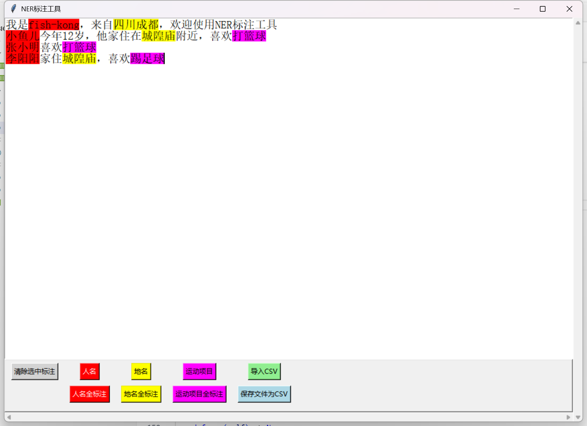
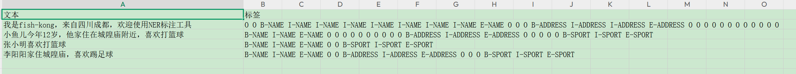

# BIO标注工具

一个基于Python和tkinter的命名实体识别（NER）标注工具，支持可视化文本标注并导出为BIO格式的CSV文件。  
  
  
## 项目简介

本工具是在[bio_annotate_tools](https://github.com/zhangbo2008/bio_annotate_tools)的基础上进行优化，重构了重要代码与增加更多功能，提供了直观的图形界面，支持多种实体类型的标注。标注结果以BIO格式保存，适用于自然语言处理和机器学习模型的训练数据准备。

## 更新日志

### 2025-11-22
- 初始版本发布
- 支持文本标注和BIO格式导出
- 支持CSV文件导入和标注恢复
- 添加彩色按钮界面
- 支持单一标注和全标注功能

## 功能特性

### 核心功能

1. **文本标注**
   - 支持在文本窗口中直接粘贴和编辑文本
   - 通过选中文本并点击标签按钮进行标注
   - 标注结果以不同颜色高亮显示，便于识别

2. **多种标注模式**
   - **单一标注**：对选中的文本片段进行标注
   - **全标注**：对全文所有匹配选中文本的位置进行批量标注
   - **清除标注**：移除选中区域的标注

3. **BIO格式导出**
   - 自动将标注结果转换为BIO格式（B-Begin, I-Inside, E-End, S-Single,O）
   - 保存为CSV文件，格式为：第一列是原始文本，第二列是空格分隔的BIO标签序列
   - 自动生成带时间戳的文件名，保存在`result/`目录下

4. **CSV文件导入**
   - 支持导入已有的CSV标注文件
   - 自动检查文件格式（必须包含"文本"和"标签"列）
   - 恢复标注结果并在界面中可视化显示
   - 支持对已标注的文件进行修改和重新保存

5. **用户界面**
   - 彩色按钮：每个标签按钮使用对应的背景色，便于快速识别
   - 滚动条支持：垂直和水平滚动条，方便查看长文本
   - 错误提示：友好的错误提示对话框

## 安装要求

- Python 3.6+
- tkinter（通常随Python安装，Windows和macOS默认包含）

## 使用方法

### 启动程序

```bash
python main.py
```

### 基本操作流程

1. **新建标注**
   - 在文本窗口中粘贴或输入要标注的文本
   - 选中需要标注的文本片段
   - 点击对应的标签按钮进行标注
   - 点击"保存文件为CSV"按钮保存结果

2. **导入已有标注**
   - 点击"导入CSV"按钮
   - 选择要导入的CSV文件
   - 系统会自动加载文本和标注结果
   - 可以继续编辑或修改标注
   - 保存修改后的结果

3. **批量标注**
   - 选中一个文本片段
   - 点击对应的"XX全标注"按钮
   - 系统会自动标注全文所有匹配的位置

## 配置说明

### 标签配置

在`config.py`文件中可以自定义标签配置：

```python
LABEL_CONFIG: List[Tuple[str, str, str]] = [
    ('white', '清除选中标注', None),  # 清除标签
    ('red',   '人名', 'NAME'),
    ('yellow','地名', 'ADDRESS'),
    # ... 手动增加更多标签
]
```

每个标签配置包含三个元素：
- **颜色**：按钮和标注显示的颜色
- **标签名称**：按钮上显示的文本
- **BIO标签名称**：保存到文件时使用的标签名（None则使用标签名称的大写形式）

### 界面配置

```python
WINDOW_CONFIG = {
    'text_width': 100,      # 文本窗口宽度
    'text_height': 30,      # 文本窗口高度
    'font': ('宋体', 15),   # 字体设置
    'default_text': '...',  # 默认文本
}
```

## 文件格式

### 输出CSV格式

保存的CSV文件格式如下：

```csv
文本,标签
贴入你要处理的文字 中文 English 都行,B-VOLTAGE E-VOLTAGE O O O O O O O O O O O B-BRANCH I-BRANCH I-BRANCH I-BRANCH I-BRANCH I-BRANCH E-BRANCH O O O
贴入你要处理的文字,B-VOLTAGE E-VOLTAGE O O O O O O O O
```

- **第一列（文本）**：原始文本行
- **第二列（标签）**：空格分隔的BIO标签序列，每个字符对应一个标签

### BIO标签说明

- **B-XXX**：实体的开始（Begin）
- **I-XXX**：实体的中间部分（Inside）
- **E-XXX**：实体的结束（End）
- **S-XXX**：单字符实体（Single）
- **O**：非实体（Outside）

### 导入文件要求

导入的CSV文件必须包含以下列：
- **文本**：要显示的文本内容
- **标签**：BIO格式的标签序列（空格分隔）

如果缺少"标签"列，系统会提示"请重新导入"。

## 项目结构

```
bio_annotate_tools/
├── main.py              # 主程序入口
├── bio_annotator.py     # 标注器核心模块
├── config.py            # 配置文件
├── README.md            # 项目说明文档
├── result/              # 输出文件目录
│   └── *.csv           # 保存的标注结果文件
└── .gitignore          # Git忽略文件配置
```

## 使用示例

### 示例1：输入或者复制粘贴文本到文本窗口，然后标注

1. 在文本窗口输入或者复制粘贴其他需要标注的文本：
   ```
   我是fish-kong，来自四川成都，欢迎使用NER标注工具
   小鱼儿今年12岁，他家住在城隍庙附近，喜欢打篮球
   张小明喜欢打篮球
   李阳阳家住城隍庙，喜欢踢足球
   ```
2. 选中"小鱼儿"，点击"人名"按钮（红色），小鱼儿会被标注为红色
3. 选中"城隍庙"，点击"地名"按钮（粉色），城隍庙会被标注为粉色，如果点击地名全标注，则第三行“李阳阳家住城隍庙”中的城隍庙也会被标注为粉色
4. 点击"保存文件为CSV"
5. 结果保存为：`result/2025-11-22-14-30-45.csv`

### 示例2：导入并修改标注
**导入前请确定标注格式是否正确，与文本导入格式.csv一致，并与config.py中的标签配置一致。如果标签与文本长度不一致，将会清除已有标注，但不会覆盖原文件。**
1. 点击"导入CSV"按钮
2. 选择之前保存的CSV文件
3. 文本和标注会自动加载并显示
4. 可以继续添加或修改标注
5. 重新保存即可，保存不会覆盖原文件，会自动再result文件夹下创建新的文件名

## 注意事项

1. **跨行标注**：系统不支持跨行的标注，如果标注跨行会显示警告并跳过
2. **文件编码**：默认导入支持utf-8与gbk编码，保存时自动转换为utf-8编码
3. **文件保存**：保存的文件会自动创建`result/`目录（如果不存在）

## 开发信息

- **开发时间**：2025-11-22
- **开发语言**：Python 3
- **GUI框架**：tkinter
- **数据格式**：CSV (BIO格式)


## 参考
- [bio_annotate_tools](https://github.com/zhangbo2008/bio_annotate_tools)